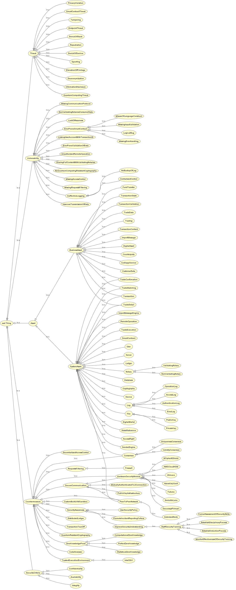

# Permissioned Blockchain-based Security Ontology

OWL-DL, and Corda-based domain-oriented security ontology CordaSecOnt. The CordaSecOnt models the system and business assets, security criteria, threats, vulnerabilities, countermeasures, and their relationships by extending the ULRO (https://mmisw.org/ont/~mubashar/ULRO). The CordaSecOnt gives reasoning in natural language about the encoded concepts of capital market's post-trade matching and confirmation's information security, Corda platform, and answers the competence questions such as: What assets to secure? Which system asset supports business assets? Which particular threat exploits which vulnerability? Which Corda-based countermeasure mitigates which vulnerability? What threats and vulnerabilities may appear in CorDapp? and What are the countermeasures to mitigate the vulnerabilities that appear within CorDapp?

## SPARQL queries
The SPARQL queries can be used to retrieve information from the CordaSecOnt. The following header code will remain the same for all the queries listed in this section.

```sql
PREFIX rdf: <http://www.w3.org/1999/02/22-rdf-syntax-ns#>
PREFIX owl: <http://www.w3.org/2002/07/owl#>
PREFIX rdfs: <http://www.w3.org/2000/01/rdf-schema#>
PREFIX xsd: <http://www.w3.org/2001/XMLSchema#>
PREFIX CordaSecOnt:
        <https://mmisw.org/ont/~mubashar/CordaSecOnt#>
```

### System assets
The following SPARQL query retrieves the system assets that support the business assets.

```sql
SELECT DISTINCT ?SystemAsset ?BusinessAsset
WHERE {
    ?SystemAsset rdfs:subClassOf CordaSecOnt:SystemAsset .
    ?SystemAsset rdfs:subClassOf ?BusinessAsset .
    ?BusinessAsset owl:onProperty CordaSecOnt:supports .
}
```

### Business assets
The following SPARQL query gets the business assets that have the security criteria constraint.

```sql
SELECT DISTINCT ?BusinessAsset ?Constraint
WHERE {
    ?BusinessAsset rdfs:subClassOf CordaSecOnt:BusinessAsset .
    ?BusinessAsset rdfs:subClassOf ?Constraint .
    ?Constraint owl:onProperty CordaSecOnt:hasConstraint .
    { ?Constraint owl:someValuesFrom
                CordaSecOnt:Confidentiality . } UNION  
    { ?Constraint owl:someValuesFrom
                CordaSecOnt:Integrity . } UNION  
    { ?Constraint owl:someValuesFrom
                CordaSecOnt:Availability . }
}
```

### Threats mitigated
The following SPARQL query brings the threats that are mitigated by using the blockchain. The query result shows the threats mitigated, associated vulnerabilities, and system assets that are targeted by the threats.

```sql
SELECT DISTINCT ?Threat ?Vulnerability ?SystemAsset
WHERE {
    ?Threat rdfs:subClassOf ?Vulnerability .
    ?Threat rdfs:subClassOf ?SystemAsset .
    ?Vulnerability owl:onProperty CordaSecOnt:exploits .
    ?SystemAsset owl:onProperty CordaSecOnt:targets .
    ?Threat rdfs:seeAlso ?Domain .
    FILTER regex(?Domain, "^Mitigated") 
}
```
### Threats appeared
The following SPARQL query brings the threats that are appeared within a blockchain-based. The query result shows the threats appeared, associated vulnerabilities, and system assets that are targeted by the threats.

```sql
SELECT DISTINCT ?Threat ?Vulnerability ?SystemAsset
WHERE {
    ?Threat rdfs:subClassOf ?Vulnerability .
    ?Threat rdfs:subClassOf ?SystemAsset .
    ?Vulnerability owl:onProperty CordaSecOnt:exploits .
    ?SystemAsset owl:onProperty CordaSecOnt:targets .
    ?Threat rdfs:seeAlso ?Domain .
    FILTER regex(?Domain, "^Appeared") 
}
```

### Countermeasures
The following SPARQL query brings the list of countermeasures to mitigate the threats.

```sql
SELECT DISTINCT ?Countermeasure ?Mitigates
WHERE {
    ?Countermeasure rdfs:subClassOf
                            CordaSecOnt:Countermeasure .
    ?Countermeasure rdfs:subClassOf ?Mitigates .
    ?Mitigates owl:onProperty CordaSecOnt:mitigates .
}
```

## Class hierarchies
CordaSecOnt "is-a" based taxonomical structure illustrates the class hierarchies.



## How to use?
Download [Protégé](https://protege.stanford.edu) editor. Load/import [CordaSecOnt](https://mmisw.org/ont/~mubashar/CordaSecOnt) in Protégé and navigate to the *Entities* tab to explore the encoded security risk management concepts.